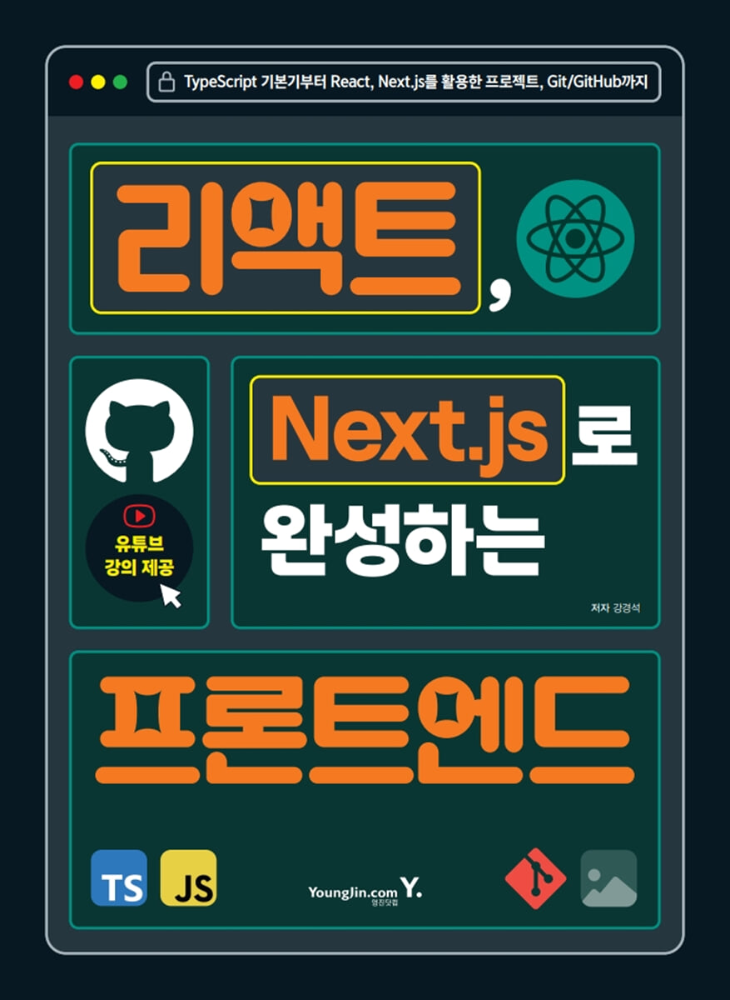

# 리액트, Next.js로 완성하는 프론트엔드

  

## 📚 학습 목적

> JavaScript와 React 기초를 복습하고, TypeScript와 Next.js를 처음부터 학습한다.

-   책의 예제 코드를 직접 작성하고 실행한다.
-   프론트엔드 개발의 기본 원리와 실무 흐름을 이해한다.
-   학습 과정과 예제 코드를 GitHub에 기록해 복습 가능한 자료로 만든다.

## 📖 참고 도서

### 리액트, Next.js로 완성하는 프론트엔드

-   저자: 강경석
-   부제: TypeScript 기본부터 React, Next.js를 활용한 프로젝트, Git/GitHub까지

## 🧰 학습 스택

## ✅ 목차별 진행 상황

-   [ ] 1장 — 리액트(React)란
-   [ ] 2장 — 자바스크립트
-   [ ] 3장 — 타입스크립트
-   [ ] 4장 — 리액트 기본편
-   [ ] 5장 — 리액트 심화편
-   [ ] 6장 — 리액트 실무편(패턴과 상태 관리)
-   [ ] 7장 — 리액트 실무편(컴포넌트)
-   [ ] 8장 — Next.js
-   [ ] 9장 — Next.js 실전 프로젝트(상)
-   [ ] 10장 — Next.js 실전 프로젝트(하)
-   [ ] 11장 — Git과 GitHub
-   [ ] 12장 — CI/CD
-   [ ] 13장 — 개발자 도구와 디버깅
-   [ ] 14장 — AI와 개발자
